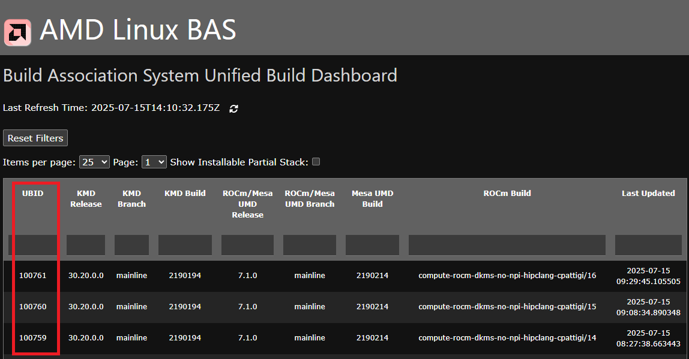
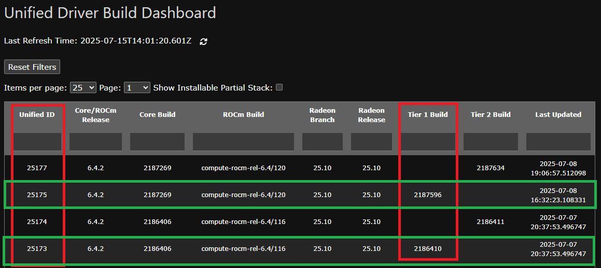

# rocm-developer-helper(rdh)
helper tools for rocm developer, available at [here](https://github.com/grantyang01/rocm-developer-helper.git)

## setup and enable rocm-developer-helper
1. clone to somewhere, such as ${HOME}/work/rdh
```bash
    git clone https://github.com/grantyang01/rocm-developer-helper.git "${HOME}/work/rdh"
```
2. enable permanently
```bash
    # register rdh self
    ${HOME}/work/rdh/scripts/register_exec_path -s

    # close/open or relauch bash to enble it:
    bash
```

3. enable in current shell
```bash
    source ${HOME}/work/rdh/activate
    bash
```

## rocm docker image
1. AMD has two dashboards to list avaible drivers
    - [Build Association System Unified Build Dashboard](http://bas.amd.com/dashboard)  
    
        + Recent drivers are listed here.
        + UBID(unified build ID) indentifies amd drivers. For example 100761, 100760 and 100759 etc, are valid drivers, and 100761 is the most recent one.
        + Other essential driver information, such as "ROCm Build", "ROCm/Mesa UMD Release" and "Mesa UMD Build", are also listed.
    - [Unified Driver Build Dashboard](http://mkdcvlnxapp01.amd.com/dashboard)  
      
        + It lists release drivers, such as rocm-6.4
        + Tier1 builds(marked with green rectangle) provide Ubuntu(24.04/noble, 22.04/jammy) supported drivers, so Unified Id 25175 and 25173 are valid drivers for Ubuntu.

2. create and use a rocm docker image
- config
    * Open  ${HOME}/work/rdh/rocm-dev/scripts/rd-config  
    * edit ubuntu_version and unified_build_id  
        + valid ubuntu_version are 22.04 and 24.04
        + unified_build_id is choosed from dashboard as you wish
```bash
ubuntu_version=22.04
unified_build_id=100730
```
- build a rocm docker
```bash
    rd-docker-build
```
    + It might take 10 minutes to build  
    + The docker image is named in rd-config , as:
```bash
    # image name
    image_name_rd=rocm-${rocm_branch}-${rocm_build}-ubuntu-${ubuntu_version}

    # listed by docker images:
    rocm-compute-rocm-dkms-no-npi-hipclang-16414-ubuntu-22.04
```

3. Usage
rdh provides three commands to simplify the usages of docker/container. 
- rd-open  
    open rocm image and attach to a terminal
- rd-enter  
    enter a existing rcom instance
- rd-close  
    close rcom instance

other dockers, such as solver docker(mentioned later), have similar commands:  
- sv-open, sv-enter, sv-close

For example, open a rocm docker and run sv-smoke-test and sv-profile inside the instance:
```bash
    # run from host
    rd-open

    # run inside rocm docker
    # sv smoke test
    sv-smoke-test
        1966439

    # sv perfmormance profile
    mkdir tmp && cd tmp
    sv-profile
        W20250715 17:19:18.219062 140647678373888 simple_timer.cpp:55] [rocprofv3] tool initialization ::     0.113654 sec
        W20250715 17:19:18.231295 140647678373888 simple_timer.cpp:55] [rocprofv3] 'rocsolver-bench -f syevd -n 8192 --evect V --iters 1 --perf 1 -r s' ::     0.000000 sec
        W20250715 17:19:18.231836 140647678373888 tool.cpp:2150] HIP (runtime) version 7.0.0 initialized (instance=0)
        W20250715 17:19:18.311767 140647678373888 tool.cpp:2150] HSA version 8.19.0 initialized (instance=0)
        3557186
        ...
        W20250715 17:19:37.475212 140647678373888 simple_timer.cpp:55] [rocprofv3] tool finalization ::     6.973051 sec
```

Enter the instance from another terminal:
```bash
    # run from host
    rd-enter

    # inside rocm docker now
    gryang@b3/rocm-dev-22:~/work$
```
rocm instance can be closed from host:
```bash
    # close rocm instance, run from host
    rd-close
```

4. Setup rocsolver image(sv image) for development environment
Pre-requirement: rd-build-docker succeeds
- Build
```bash
    # run it in host
    sv-docker-build

    # it might take two hours to complete, with status in end of building:
        [sv-build-code] clone status: 0
        rocPRIM: succ
        hipBLAS-common: succ
        hipBLASLt: succ
        rocBLAS: succ
        rocSOLVER: succ

        [sv-build-code] build status: 0
        rocPRIM build: succ
        hipBLAS-common build: succ
        hipBLASLt build: succ
        rocBLAS build: succ
        rocSOLVER build: succ

    # sv image name
    solver-rocm-compute-rocm-dkms-no-npi-hipclang-16414-ubuntu-22.04
```
Latest code(developer branch) have been built and installed in the sv image.

- usage  
Open a sv(rocsolver) image
```bash
    # run it in host
    sv-open

    # inside sv docker now
    gryang@b3/solver:~/work$    
```

rocsolver and related codes are under ${HOME}/work/solver
```bash
        ${HOME}/work/solver
        |-- hipblas-common
        |-- hipblaslt
        |-- rocblas
        |-- rocprim
        `-- rocsolver
```

- The above components has already been built and updated with latest code(developer branch)
    * hipblas-common and rocprim contains header files without binaries, so the release/debug build doesn't matter.
    * hipblaslt and rocblas have both release/debug build(library only) ready
    * rocsolver has release build for library and client, but only relWithDbg for library, and clients for debug build. (clang 20 crashed during debug build of library)
    * hipblaslt, rocblas, and rocsolver have relase build installed
    * Below commands switching to debug build for rocblas or hipblaslt, and same method applies to rocsolver(release-debug, release with debug info):
```bash
    # run in host to open sv docker
    sv-open

    # install debug build for rocblas
    # run inside sv docker instance
    #  rocblas: install debug build
    cd ${HOME}/work/solver/rocblas/build/debug
    sudo cmake --install . --prefix $ROCM_PATH

    #  rocsolver: install release with dbg info 
    cd ${HOME}/work/solver/rocsolver/build/release-debug/
    sudo cmake --install . --prefix $ROCM_PATH
```

- After modified a component, it needs to be rebuilt and updated. Below is example for rocsolver:
```bash
    # run in host to open sv docker
    sv-open

    # run inside sv docker instance
    cd ${HOME}/work/solver/rocsolver/build/release

    # build the changes
    make -j$(nproc)

    # update changes
    sudo cmake --install . --prefix $ROCM_PATH
```

- The changes would not be peristed during docker close and reopen. If you want to keep the changes in docker image, please save the instance by:
```bash
    # run at host 
    docker commit solver solver-rocm-compute-rocm-dkms-no-npi-hipclang-16414-ubuntu-22.04
```